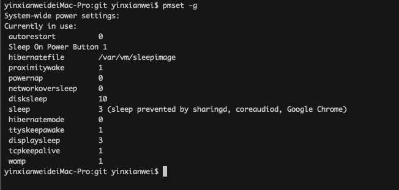

# Hackintosh


## 配置清单

- 主板: 技嘉Z370N WiFi
- CPU: i7-8700
- 硬盘: 三星 NVMe970 EVO 250G
- 内存: 海盗船复仇者 LPX DDR4 3000 16G x 2
- 网卡: BCM94360CS2 M.2转换卡
- 散热器:  猫头鹰 NH-L9i
- 机箱: [MetalSolidd MINI](https://item.taobao.com/item.htm?spm=a230r.1.14.23.185b4ca7przU87&id=525092703456&ns=1&abbucket=19#detail)
- 电源: DC-ATX 200W


## 自动睡眠

```shell
$ pmset -g
```



```shell
$ sudo pmset parametr_name 0
$ sudo pmset standby 0
$ sudo pmset womp 0
$ sudo pmset proximitywake 0
$ sudo pmset powernap 0
$ sudo pmset disksleep 10
$ sudo pmset sleep 10
$ sudo pmset autopoweroff 0
```

## TODO

- DP不能用，目前只能用HDMI连接显示器


感谢： 

[http://bbs.pcbeta.com/viewthread-1797335-1-1.html](http://bbs.pcbeta.com/viewthread-1797335-1-1.html)   
[https://github.com/b166ar/Mac-Mini-Killer](https://github.com/b166ar/Mac-Mini-Killer)   
[https://www.reddit.com/r/hackintosh/comments/8eew1y/hz370n_wifi_card_replacement](https://www.reddit.com/r/hackintosh/comments/8eew1y/hz370n_wifi_card_replacement/)   

