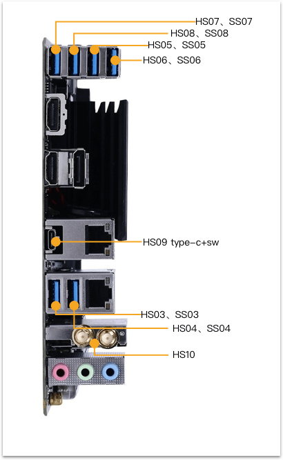

# Hackintosh

macOS Mojave 10.14.4 

### 配置清单:

- 主板: 技嘉Z370N WiFi
- CPU: i7-8700
- 硬盘: 三星 NVMe970 EVO 250G
- 内存: 海盗船复仇者 LPX DDR4 3000 16G x 2
- 网卡: BCM94360CS2 + M.2转换卡
- 散热器: 猫头鹰 NH-L9i
- 机箱: 乔思伯UMX1 PLUS
- 电源: 海盗船SF600
- 显卡: RX560

### BIOS设置:

Peripherals:

- Initial Display Output -> PCIe 1 Slot

Chipset:

- VT-d -> disabled
- DVMT Pre-Allocated -> 128M
- DVMT Total Gfx Mem -> 128M
- Wake on LAN Enable -> Disabled

### 定制USB:

教程参考：https://blog.daliansky.net/Intel-FB-Patcher-tutorial-and-insertion-pose.html

### 感谢:

[http://bbs.pcbeta.com/viewthread-1797335-1-1.html](http://bbs.pcbeta.com/viewthread-1797335-1-1.html)   
[https://github.com/b166ar/Mac-Mini-Killer](https://github.com/b166ar/Mac-Mini-Killer)   
[https://www.reddit.com/r/hackintosh/comments/8eew1y/hz370n_wifi_card_replacement](https://www.reddit.com/r/hackintosh/comments/8eew1y/hz370n_wifi_card_replacement/)   
